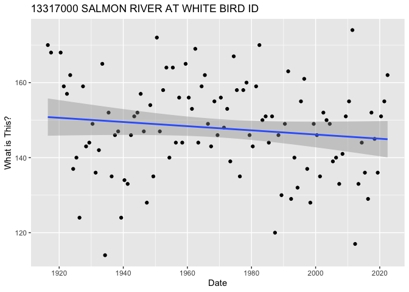

GEOS 212 R Flood Frequency Analysis Example
================
2023-03-11

### By: Lejo Flores

## Introduction

In this RMarkdown document, I show how we can use the R programming
language to perform the same flood frequency analysis that we did in a
previous module. But in this case, we are using some really cool tools
developed by scientists at the USGS to access the same peak flow data we
previously accessed from the National Water Information System. These
tools allow us to call something called an “API,” or application
programming interface. An API is just a way that we can access the NWIS
website to get data, but instead of using the webpage we can just tell
the API which USGS site we want data from (using the site ID), as well
as the start and end date. Because this is a program, moreover, if we
want to perform the analysis on any other site we can just change the
site ID (and start and end dates, if need be). Finally, because we’re
using R we can generate plots using a set of commands or instructions
rather than having to use a point-and-click set of menus. This is nice
because if we mess up a plot or want to add something, we can change or
add commands and just rerun the plotting clode.

## First things

The first things we need to do in our code is to tell R where our
working directory is (i.e., the folder on our computer where we want to
work) using the `setwd()` command. Then we need to tell R that we’ll be
using some libraries using the `library` command. A library is just a
toolbox that has some specialized tools in it that allow us to do
certain things. The `dataRetrieval` library we’ll use, for instance, is
written by the USGS and will allow us to retrieve peak flow data with a
site ID and start and end dates. The `ggplot2` library is a cool library
that allows us to make plots that look nice enough to include them in
presentations, reports, and publications. Finally, the `scales` library
will allow us to format how the numbers are rendered on our plots.

``` r
setwd('~/WinW-R-workshop/') # Set the working directory

library('dataRetrieval') # This is a USGS library to get data from the NWIS website
library('ggplot2') # This library provides us ways to make compelling plots
library('scales') # This library allows us to manipulate how numbers are shown on our plots
library('plotly')
```

    ## 
    ## Attaching package: 'plotly'

    ## The following object is masked from 'package:ggplot2':
    ## 
    ##     last_plot

    ## The following object is masked from 'package:stats':
    ## 
    ##     filter

    ## The following object is masked from 'package:graphics':
    ## 
    ##     layout

## Prepare to Retrieve Peak Flow Data

Now we need to prepare to retrieve the data. Specifically, we will
create a couple of variables that will store our USGS 8-digit site ID,
and the starting and ending dates for which we want data. Note, that
although we’re getting annual peak data, we will pass a full date that
encompass the first and last water years we would like to obtain data
for. In R we can create a variable using the `<-` argument. For example,
the R statement `x <- 24.4` can be read “set the variable x equal to
24.4.”

``` r
site_id <- '13317000' # Salmon River At White Bird ID

start_date <- '1915-10-01' # First day of water year
end_date <- '2022-09-30' # Last day of water year
```

Note in the above that the site ID is enclosed in quotes, even though it
is a number. This makes it something called a “string” or just a
sequence of alphanumeric characters. This is important because the USGS
function we will use to get the data requires that the site ID be passed
as a string. Similarly, the start and end dates are strings that are
specially formatted as `YYYY-MM-DD`.

## Now Get the Data

Now we call the function `readNWISpeak` to get annual peak flow data. We
are able to use this function because when whe called
`libary(dataRetrieval)` it opened a tool box of a variety of functions
for accessing USGS data. The function takes as input the site ID (the
unique USGS identifier for a gage), the start date and end date. It
returns the data into something that is called a “dataframe.” You can
think of a dataframe as a spreadsheet (and some metadata — more on that
in a minute) that lives in a variable that we have called `df` below.
I’ve printed the first 10 rows of the dataframe below, and you can see
that it effectively just looks like the first 10 lines of our Excel
spreadsheet before we hid and deleted a lot of columns to “clean it up.”
What’s so powerful about the dataframe construct is that there are many
things we can do with it – and the data stored within it – wihout having
to extract or manipulate rows and columns in special ways.

``` r
# Retrieve the data
df <- readNWISpeak(site_id, startDate = start_date, endDate = end_date)
df[1:10,1:6]
```

    ##    agency_cd  site_no    peak_dt peak_tm peak_va peak_cd
    ## 1       USGS 13317000 1916-06-19    <NA>   84900       1
    ## 2       USGS 13317000 1917-06-18    <NA>   77000       1
    ## 3       USGS 13317000 1920-06-17    <NA>   56700       1
    ## 4       USGS 13317000 1921-06-09    <NA>   88800       1
    ## 5       USGS 13317000 1922-06-07    <NA>   67200       1
    ## 6       USGS 13317000 1923-06-12    <NA>   56000       1
    ## 7       USGS 13317000 1924-05-17    <NA>   40100       1
    ## 8       USGS 13317000 1925-05-21    <NA>   58600       1
    ## 9       USGS 13317000 1926-05-05    <NA>   30600       1
    ## 10      USGS 13317000 1927-06-09    <NA>   73800       1

We can also get information about the site itself through the metadata
for the dataframe, which are stored in something called attributes. The
command `attr(df, 'siteInfo')` returns attributes in the form of a list
of information. Each element of the list has a name and associated value
(known as a key-value pair). In this case we want the text that is
stored in the `siteInfo` attribute variable called `station_nm`. This
corresponds to a string containing the name of the station. This again
is just a character string, but we can use it to do cool things like add
informative titles to plots.

``` r
station_nm <- attr(df, 'siteInfo')$station_nm
station_nm
```

    ## [1] "SALMON RIVER AT WHITE BIRD ID"

## Create a Plot

Now let’s create a very simple plot – containing labels – of the annual
peak flow versus time. To do this we will invoke the `ggplot()` method
and then add points to the plot using `geom_point()`. Note that in
`geom_point()` we are telling ggplot to use data from the dataframe
(`df`) where our peak flow data is stored and telling it to plot the
value of the peak flow (`peak_va`) versus time (`peak_dt`). We then add
a command `scale_y_continuous()` that tells ggplot that the y-axis
should show numbers as numbers with commas separating the thousands
(instead of scientific notation) and use the `labs()` command to tell
ggplot to add a title, and x- and y-axis labels. The command `paste()`
creates a title that is specific to this gage by using the `site_id` and
the `station_nm` strings.

``` r
ggplot() + 
  geom_point(data = df, aes(x = peak_dt, y = peak_va)) +
  scale_y_continuous(labels = comma) +
  labs(title = paste('Annual Peak Flows',site_id, station_nm), 
  x = 'Date', y = 'Peak Flow [cfs]')
```

<!-- -->

## Perform the Flood Frequency Analysis

Now it’s time to do the flood frequency analysis that we did in the lab.
If you recall the first thing that we did with our peak flow data was
sort it from highest to lowest, and then assign a numeric rank to each
flow (rank = 1 being the highest historical peak flow). In R we can do
this pretty straightforwardly using the `sort()` function. You’ll note
that we use the optional input `decreasing = TRUE` to make sure that the
flows are sorted from highest to lowest. You’ll also note that we call
the peak flows using the argument `df$peak_va`. This tells R to call the
`peak_va` column of our dataframe, where our peak flows are stored. We
can create an array or vector of numbers in R using the `:` operator. In
this case, the `rank <- 1:length(q_sort)` command tells R to “create a
vector of whole numbers from 1 to the length of `q_sort` (our sorted
peak flows) and store it in the variable `rank`.

``` r
q_sort <- sort(df$peak_va, decreasing = TRUE)
rank <- 1:length(q_sort)
```

Now, we’ll use the Weibull and Gringorten plotting position formulas to
compute exceedance probabilities for each of our flows. Recall these
equations are as follows for,

Weibull:

$$
P_E = \frac{i}{N+1}
$$

where $i$ equals the rank of the flow and $N$ is the number of years of
peak flow data we have. Similarly the Gringorten equation was:

$$
P_E = \frac{i - \alpha}{N + 1 - 2\alpha}
$$

where $i$ and $N$ are the same as before, and $\alpha$ is an empirical
parameter we took as 0.44.

The amazingly powerful thing about R and other programming languages
like Python is that we can perform calculations with our vectors just
using simple operators like `+`, `-`, `*`, and `/` for addition,
subtraction, element-by-element multiplication, and element-by-element
division. \[Note: for those asking, yes, we can also carry out more
complicated matrix-vector and matrix-matrix multiplications, as well as
matrix inversion in R. But we’ll leave that for another time.\] As such,
we can compute the exceedence probability and return intervals for the
peak flows as follows:

``` r
# Compute return intervals of flows using Weibull plotting position
p_e_weibull <- rank / (length(q_sort) + 1)
t_weibull <- 1 / p_e_weibull

# Compute return intervals of flows using Gringorten plotting position
p_e_gringorten <- (rank - 0.44) / (length(q_sort) + 1 - 2*0.44)
t_gringorten <- 1 / p_e_gringorten
```

Now let’s do our flood frequency analysis using the Gumbel continuous,
parametric model. If you remember, we had to compute two parameters of
the Gumbel model, $\alpha$ and $u$, where

$$ 
\alpha = \frac{\sqrt{6} \cdot s_x}{\pi}
$$

and,

$$
u = \bar{x} - 0.5772\alpha
$$

where $\bar{x}$ was the sample mean (the mean of our peak flows), and
$s_x$ was the sample standard deviation (the standard deviation of our
peak flows). Another cool think about R and other programming languages
is that doing things like computing means and standard deviations of
data are so common that we’re provided built-in functions to compute
them. So, in the following we can compute the mean by issuing the
command `xbar <- mean(q_sort)` and the standard deviation by issuing the
command `s_x <- sd(q_sort)`.

Also note that I’m computing the values of the flows for the Gumbel
model a little differently. I am specifying the non-exceedence
probabilities at which I’d like to calculate the flows. And then I’m
using the **inverse** Gumbel distribution to calculate what those flows
would be, given the parameter values I’ve calculated. I’m doing it this
way because, since the Gumbel distribution is a parametric model I can
get the value of the flow at whatever return interval I want,
***regardless*** of whether or not I have the length of record to
support calculation of that return interval. In this case, I use the
`seq()` command to give me a vector of points starting at 0.001 and
going to 0.999 in increments of 0.001. A non-exceedence probability of
0.999 (i.e., a flow that ***would not*** be exceeded 99.9% of years, on
average) corresponds to a return interval of 1000 years. The inverse of
the Gumbel distribution is given as,

$$
q_P = u - \alpha\cdot \ln\left(-\ln \left(P_{NE}\right) \right)
$$

Where $q_P$ is the flow corresponding to the $P_{NE}$ non-exceedence
probability.

``` r
# Compute return intervals of flows using Gumbel
xbar <- mean(q_sort)
s_x <- sd(q_sort)
alpha <- sqrt(6)*s_x / pi
u <- xbar - 0.5772*alpha

p_ne_gumbel <- seq(from = 0.001, to = 0.999, by = 0.001)
p_e_gumbel = 1 - p_ne_gumbel
t_gumbel <- 1 / p_e_gumbel

q_gumbel = u - alpha*log(-log(p_ne_gumbel)) 
```

## Plot the Results

``` r
p2 <- ggplot() + 
  geom_point(data = NULL, aes(t_gringorten,q_sort), color='red') + 
  geom_point(data = NULL, aes(t_weibull,q_sort), color='blue') + 
  geom_line(data = NULL, aes(t_gumbel,q_gumbel), color='chartreuse4') +
  scale_x_continuous(trans = 'log10') + 
  scale_y_continuous(labels = comma) +
  labs(title = paste('Flood Frequency for Site',site_id, station_nm), 
  x = 'Return Interval [Years]', y = 'Peak Flow [cfs]')

p2 # Tell R to show the plot
```

<!-- -->

Based on our previous description of the first plot we made above, can
you interpret what each line of the above is doing?

## Get Values for the 100-year Flood

A really nice thing about R and other programming languages are that I
can get a more precise estimate of the 100-year (or other return
interval floods) by using something called *interpolation*. Here we can
use the `interp1()` R command to interpolate.

``` r
q100_weibull = approx(t_weibull,q_sort, 100.0, method='linear')
q100_gringorton = approx(t_gringorten,q_sort, 100.0, method='linear')
q100_gumbel = approx(t_gumbel,q_gumbel, 100.0, method='linear')

q100_weibull
```

    ## $x
    ## [1] 100
    ## 
    ## $y
    ## [1] 127283

``` r
q100_gringorton
```

    ## $x
    ## [1] 100
    ## 
    ## $y
    ## [1] 112505.2

``` r
q100_gumbel
```

    ## $x
    ## [1] 100
    ## 
    ## $y
    ## [1] 132877.5

## Reflection Questions

1.  How could we repeat this analysis for a different gage and what
    would we have to change?
2.  If a gage didn’t have a long enough record to compute, for instance,
    the 100-year flood, how might you determine that you have less than,
    say 99 years of data?

## Bonus Exercise

What does the following code do?

``` r
qdates <- df$peak_dt
daynum <- df$peak_dt - as.Date(format(df$peak_dt, format='%Y-01-01'))

df_new <- data.frame(qdates,daynum)

ggplot(df_new, aes(x = qdates, y = daynum)) + 
  geom_point() +
  scale_y_continuous(labels = comma) +
  labs(title = paste(site_id, station_nm), 
  x = 'Date', y = 'What is This?') +
  stat_smooth(method='lm', formula = y ~ x)
```

<!-- -->
