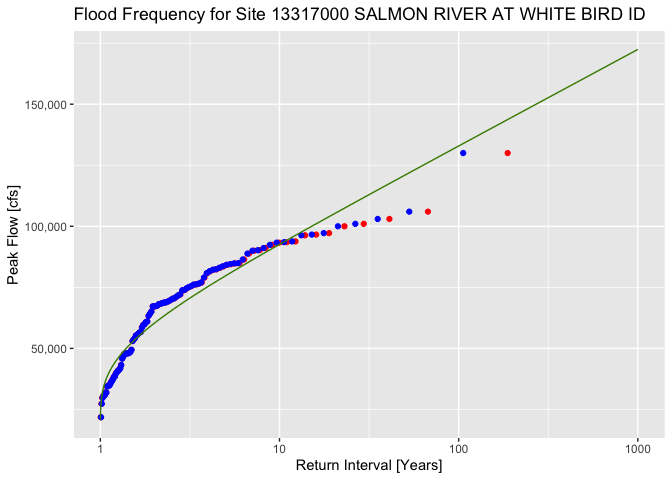

GEOS 212 R Flood Frequency Analysis Example
================
2023-03-11

## Introduction

In this RMarkdown document, I show how we can use the R programming
language to perform the same flood frequency analysis that we did in a
previous module. But in this case, we are using some really cool tools
developed by scientists at the USGS to access the same peak flow data we
previously accessed from the National Water Information System. These
tools allow us to call something called an “API,” or application
programming interface. An API is just a way that we can access the NWIS
website to get data, but instead of using the webpage we can just tell
the API which USGS site we want data from (using the site ID), as well
as the start and end date. Because this is a program, moreover, if we
want to perform the analysis on any other site we can just change the
site ID (and start and end dates, if need be). Finally, because we’re
using R we can generate plots using a set of commands or instructions
rather than having to use a point-and-click set of menus. This is nice
because if we mess up a plot or want to add something, we can change or
add commands and just rerun the plotting clode.

### First things

The first things we need to do in our code is to tell R where our
working directory is (i.e., the folder on our computer where we want to
work) using the `setwd()` command. Then we need to tell R that we’ll be
using some libraries using the `library` command. A library is just a
toolbox that has some specialized tools in it that allow us to do
certain things. The `dataRetrieval` library we’ll use, for instance, is
written by the USGS and will allow us to retrieve peak flow data with a
site ID and start and end dates. The `ggplot2` library is a cool library
that allows us to make plots that look nice enough to include them in
presentations, reports, and publications. Finally, the `scales` library
will allow us to format how the numbers are rendered on our plots.

``` r
setwd('~/WinW-R-workshop/') # Set the working directory

library('dataRetrieval') # This is a USGS library to get data from the NWIS website
library('ggplot2') # This library provides us ways to make compelling plots
library('scales') # This library allows us to manipulate how numbers are shown on our plots
```

### Prepare to Retrieve Peak Flow Data

Now we need to prepare to retrieve the data. Specifically, we will
create a couple of variables that will store our USGS 8-digit site ID,
and the starting and ending dates for which we want data. Note, that
although we’re getting annual peak data, we will pass a full date that
encompass the first and last water years we would like to obtain data
for. In R we can create a variable using the `<-` argument. For example,
the R statement `x <- 24.4` can be read “set the variable x equal to
24.4.”

``` r
site_id <- '13317000' # Salmon River At White Bird ID

start_date <- '1915-10-01' # First day of water year
end_date <- '2022-09-30' # Last day of water year
```

Note in the above that the site ID is enclosed in quotes, even though it
is a number. This makes it something called a “string” or just a
sequence of alphanumeric characters. This is important because the USGS
function we will use to get the data requires that the site ID be passed
as a string. Similarly, the start and end dates are strings that are
specially formatted as `YYYY-MM-DD`.

### Now Get the Data

Now we call the function `readNWISpeak` to get annual peak flow data. We
are able to use this function because when whe called
`libary(dataRetrieval)` it opened a tool box of a variety of functions
for accessing USGS data. The function takes as input the site ID (the
unique USGS identifier for a gage), the start date and end date. It
returns the data into something that is called a “dataframe.” You can
think of a dataframe as a spreadsheet (and some metadata — more on that
in a minute) that lives in a variable that we have called `df` below.
I’ve printed the first 10 rows of the dataframe below, and you can see
that it effectively just looks like the first 10 lines of our Excel
spreadsheet before we hid and deleted a lot of columns to “clean it up.”
What’s so powerful about the dataframe construct is that there are many
things we can do with it – and the data stored within it – wihout having
to extract or manipulate rows and columns in special ways.

``` r
# Retrieve the data
df <- readNWISpeak(site_id, startDate = start_date, endDate = end_date)
df[1:10, ]
```

    ##    agency_cd  site_no    peak_dt peak_tm peak_va peak_cd gage_ht gage_ht_cd
    ## 1       USGS 13317000 1916-06-19    <NA>   84900       1      NA       <NA>
    ## 2       USGS 13317000 1917-06-18    <NA>   77000       1      NA       <NA>
    ## 3       USGS 13317000 1920-06-17    <NA>   56700       1      NA       <NA>
    ## 4       USGS 13317000 1921-06-09    <NA>   88800       1      NA       <NA>
    ## 5       USGS 13317000 1922-06-07    <NA>   67200       1      NA       <NA>
    ## 6       USGS 13317000 1923-06-12    <NA>   56000       1      NA       <NA>
    ## 7       USGS 13317000 1924-05-17    <NA>   40100       1      NA       <NA>
    ## 8       USGS 13317000 1925-05-21    <NA>   58600       1      NA       <NA>
    ## 9       USGS 13317000 1926-05-05    <NA>   30600       1      NA       <NA>
    ## 10      USGS 13317000 1927-06-09    <NA>   73800       1      NA       <NA>
    ##    year_last_pk ag_dt ag_tm ag_gage_ht ag_gage_ht_cd peak_dateTime
    ## 1            NA  <NA>  <NA>         NA          <NA>          <NA>
    ## 2            NA  <NA>  <NA>         NA          <NA>          <NA>
    ## 3            NA  <NA>  <NA>         NA          <NA>          <NA>
    ## 4            NA  <NA>  <NA>         NA          <NA>          <NA>
    ## 5            NA  <NA>  <NA>         NA          <NA>          <NA>
    ## 6            NA  <NA>  <NA>         NA          <NA>          <NA>
    ## 7            NA  <NA>  <NA>         NA          <NA>          <NA>
    ## 8            NA  <NA>  <NA>         NA          <NA>          <NA>
    ## 9            NA  <NA>  <NA>         NA          <NA>          <NA>
    ## 10           NA  <NA>  <NA>         NA          <NA>          <NA>

``` r
station_nm <- attr(df, 'siteInfo')$station_nm
```

``` r
ggplot() + 
  geom_point(data = df, aes(x = peak_dt, y = peak_va)) +
  scale_y_continuous(labels = comma) +
  labs(title = paste('Annual Peak Flows',site_id, station_nm), 
  x = 'Date', y = 'Peak Flow [cfs]')
```

<!-- -->

``` r
q_sort <- sort(df$peak_va, decreasing = TRUE)
rank <- 1:length(q_sort)

# Compute return intervals of flows using Weibull plotting position
p_e_weibull <- rank / (length(q_sort) + 1)
t_weibull <- 1 / p_e_weibull

# Compute return intervals of flows using Gringorten plotting position
p_e_gringorten <- (rank - 0.44) / (length(q_sort) + 1 - 2*0.44)
t_gringorten <- 1 / p_e_gringorten

# Compute return intervals of flows using Gumbel
xbar <- mean(q_sort)
s_x <- sd(q_sort)
alpha <- sqrt(6)*s_x / pi
u <- xbar - 0.5772*alpha

p_e_gumbel <- seq(from = 0.001, to = 0.999, by = 0.001)
t_gumbel <- 1 / (1 - p_e_gumbel)

q_gumbel = u - alpha*log(-log(p_e_gumbel)) 
```

``` r
p2 <- ggplot() + 
  geom_point(data = NULL, aes(t_gringorten,q_sort), color='red') + 
  geom_point(data = NULL, aes(t_weibull,q_sort), color='blue') + 
  geom_line(data = NULL, aes(t_gumbel,q_gumbel), color='chartreuse4') +
  scale_x_continuous(trans = 'log10') + 
  scale_y_continuous(labels = comma) +
  labs(title = paste('Flood Frequency for Site',site_id, station_nm), 
  x = 'Return Interval [Years]', y = 'Peak Flow [cfs]')

p2
```

<!-- -->
